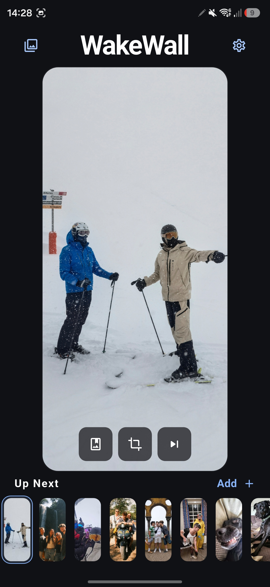
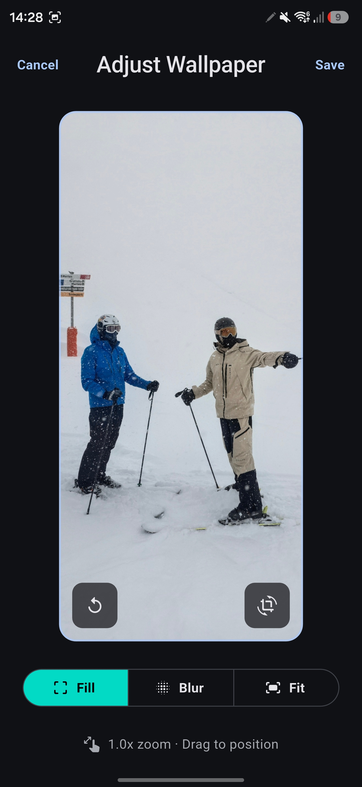
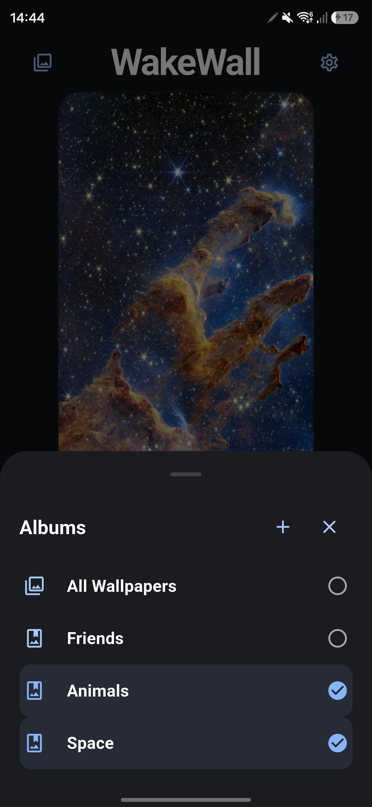
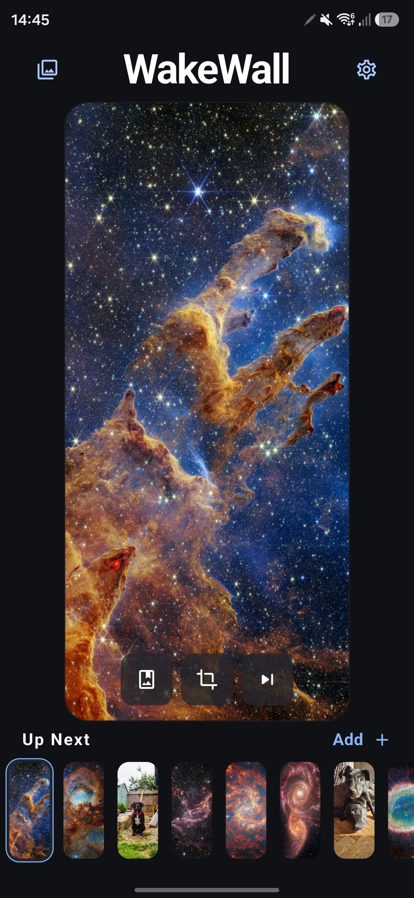
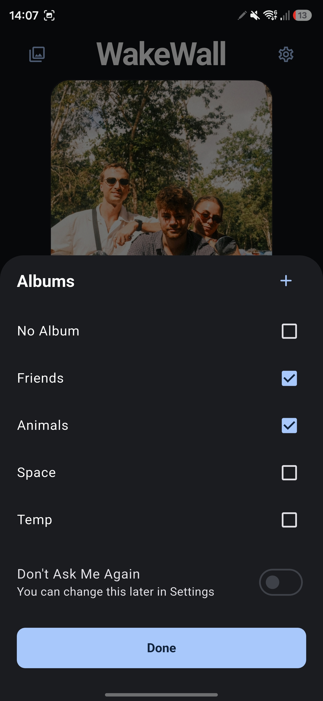
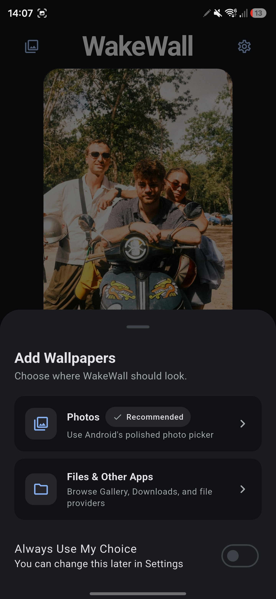
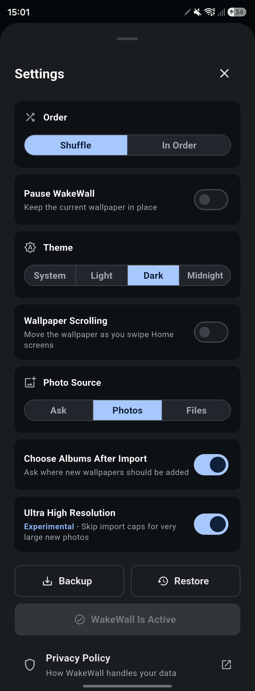

# WakeWall


WakeWall is an Android live wallpaper app that rotates through a user-selected collection of photos. It is built to solve a small but stubborn Android personalisation gap that iOS handles natively: a polished wallpaper shuffle that feels built into the phone. Android has workarounds and a small handful of third-party apps, but they often switch after the phone has already unlocked, rely on timers, offer limited control, and look like old utility tools.

WakeWall keeps the workflow simple:

```text
Choose Wallpapers -> Preview and Adjust -> Wake to a Fresh Image
```

WakeWall utilises a native Android live wallpaper engine to prepare the next image before the phone wakes .This results in a wallpaper switcher that feels native to the phone, rather than bolted on.


## Contents

- [Demo](#demo)
- [Built With](#built-with)
- [Project Highlights](#project-highlights)
- [Feature Overview](#feature-overview)
- [How The Wallpaper Switching Works](#how-the-wallpaper-switching-works)
- [Image Quality And Cropping](#image-quality-and-cropping)
- [Albums, Backup, And Storage](#albums-backup-and-storage)
- [Architecture](#architecture)
- [Key Files](#key-files)
- [Running And Building](#running-and-building)
- [Current Status](#current-status)
- [Project Goal](#project-goal)

## Demo

WakeWall keeps its core workflow on one screen, then reveals more control only when it is useful. The screenshots below were captured on a 19.5:9 Samsung display. Select any screenshot to open the full-resolution image.

<table width="900">
  <tr>
    <td width="280" valign="top">
      <a href="docs/screenshots/wakewall-home-19-5x9.jpg">
        
      </a>
    </td>
    <td width="620" valign="top">
      <h3>Everything you need, one screen</h3>
      <p>The home screen is deliberately focused: a large, accurate preview of the active wallpaper sits above the collection that will rotate next.</p>
      <ul>
        <li><strong>Albums:</strong> open the top-left panel to create albums and choose which collections are currently visible and rotating.</li>
        <li><strong>Settings:</strong> use the cog to control rotation order, pausing, themes, scrolling, backups, and wallpaper activation.</li>
        <li><strong>Organise wallpaper:</strong> use the first preview control to add the current photo to one or more albums.</li>
        <li><strong>Adjust wallpaper:</strong> open the crop editor to reposition, rotate, zoom, or change how the current photo fills the screen.</li>
        <li><strong>Next wallpaper:</strong> advance the active wallpaper manually without waiting for the next screen wake.</li>
        <li><strong>Add:</strong> import one or more new photos and optionally organise them into albums during the same flow.</li>
        <li><strong>Up Next:</strong> scroll through the queue and select any thumbnail to display it immediately. Press and hold a thumbnail to reorder it, or drag it to the remove target to delete it with a short Undo window.</li>
      </ul>
    </td>
  </tr>
  <tr>
    <td width="280" valign="top">
      <a href="docs/screenshots/wakewall-crop-editor-19-5x9.jpg">
        
      </a>
    </td>
    <td width="620" valign="top">
      <h3>Fine-tune every wallpaper</h3>
      <p>Every photo can be positioned for the phone rather than forced through one global crop. Pinch to zoom, drag to position, rotate when needed, and choose the display treatment that best suits the source image.</p>
      <p><strong>Display modes</strong></p>
      <ul>
        <li><code>Fill</code> uses the full screen and allows edge cropping.</li>
        <li><code>Blur</code> preserves the whole photo over a softened extension.</li>
        <li><code>Fit</code> places the complete image over a chosen solid colour.</li>
      </ul>
      <p><strong>Image controls</strong></p>
      <ul>
        <li><strong>Rotate:</strong> turn the source image clockwise in 90-degree steps before positioning it.</li>
        <li><strong>Reset:</strong> return zoom, position, rotation, display mode, and background colour to their defaults. The button appears only after something has been adjusted.</li>
      </ul>
      <p>WakeWall stores these choices per wallpaper and regenerates the native wallpaper render when the edit is saved.</p>
    </td>
  </tr>
  <tr>
    <td width="280" valign="top">
      <a href="docs/screenshots/wakewall-albums-19-5x9.jpg">
        
      </a>
    </td>
    <td width="620" valign="top">
      <h3>Group wallpapers into collections</h3>
      <p>Albums let you group wallpapers around a person, place, theme, or occasion. A photo can belong to several albums while its image files remain stored only once.</p>
      <ul>
        <li><code>All Wallpapers</code> always provides a complete catch-all view.</li>
        <li>Use the <code>+</code> button to create an album here, or create one while importing new photos.</li>
        <li>Select one or several albums to combine their wallpapers in both the visible collection and the active rotation pool.</li>
        <li>Press and hold an album to remove it. WakeWall can also delete photos exclusive to that album, while preserving any that belong to another album.</li>
        <li>The bottom sheet keeps organisation close at hand without cluttering the home screen.</li>
      </ul>
    </td>
  </tr>
  <tr>
    <td width="280" valign="top">
      <a href="docs/screenshots/wakewall-space-and-animals-19-5x9.jpg">
        
      </a>
    </td>
    <td width="620" valign="top">
      <h3>Mix and match albums</h3>
      <p>Selecting the <code>Space</code> and <code>Animals</code> themes combines both albums into one focused collection.</p>
      <ul>
        <li>The home screen and <code>Up Next</code> queue update to show wallpapers from either selected album.</li>
        <li>Automatic rotation follows the same filtered collection.</li>
        <li>Photos shared by both albums still appear only once and remain stored only once.</li>
        <li>Changing the selection never moves or alters the underlying photos.</li>
      </ul>
    </td>
  </tr>
  <tr>
    <td width="280" valign="top">
      <a href="docs/screenshots/wakewall-album-selection-19-5x9.jpg">
        
      </a>
    </td>
    <td width="620" valign="top">
      <h3>Organise photos as you add them</h3>
      <p>Assign a photo using the album button on its main preview, or choose its albums when it is first imported.</p>
      <ul>
        <li>Select one or several albums for the imported photos.</li>
        <li>Choose <code>No Album</code> to keep them in <code>All Wallpapers</code> only.</li>
        <li>Use <code>+</code> to create a new album without leaving the import.</li>
        <li><code>Don't Ask Me Again</code> can skip this step on future imports and be reversed later in Settings.</li>
      </ul>
    </td>
  </tr>
  <tr>
    <td width="280" valign="top">
      <a href="docs/screenshots/wakewall-add-wallpapers-19-5x9.jpg">
        
      </a>
    </td>
    <td width="620" valign="top">
      <h3>Add photos from anywhere</h3>
      <p>WakeWall supports two familiar Android import routes, making it easy to choose several wallpapers from the source that suits them.</p>
      <ul>
        <li><strong>Photos:</strong> use Android's polished photo picker for a focused, privacy-friendly selection.</li>
        <li><strong>Files &amp; Other Apps:</strong> browse Gallery, Downloads, cloud storage, and other available file providers.</li>
        <li><strong>Always Use My Choice:</strong> skip this question on future imports and change the preference later in Settings.</li>
      </ul>
    </td>
  </tr>
  <tr>
    <td width="280" valign="top">
      <a href="docs/screenshots/wakewall-settings-scrollshot.jpg">
        
      </a>
    </td>
    <td width="620" valign="top">
      <h3>Set it up your way</h3>
      <p>The full Settings sheet keeps everyday preferences, collection tools, and privacy information together without crowding the main screen.</p>
      <ul>
        <li><strong>Order:</strong> shuffle the collection for a surprise on each wake, or follow the queue from beginning to end.</li>
        <li><strong>Pause WakeWall:</strong> keep the current wallpaper in place until automatic rotation is resumed.</li>
        <li><strong>Theme:</strong> follow the phone's system setting or choose the Light, Dark, or deeper Midnight appearance.</li>
        <li><strong>Wallpaper Scrolling:</strong> let the wallpaper move as the user swipes between Home screens on launchers that support it.</li>
        <li><strong>Photo Source:</strong> ask on every import, or go straight to the Android Photos or Files picker.</li>
        <li><strong>Choose Albums After Import:</strong> decide immediately which albums should receive newly added wallpapers.</li>
        <li><strong>Ultra High Resolution:</strong> optionally skip WakeWall's normal import caps for very large new photos. The feature is marked experimental because it uses more storage and device resources.</li>
        <li><strong>Backup &amp; Restore:</strong> export or recover the collection together with its order, crops, albums, display modes, and settings.</li>
        <li><strong>Activation:</strong> see whether WakeWall is currently the active wallpaper and activate it from the same place when needed.</li>
        <li><strong>Privacy Policy:</strong> open a clear account of how WakeWall handles data; chosen images and app data remain on the device.</li>
      </ul>
    </td>
  </tr>
</table>

## Built With

WakeWall is intentionally small on the surface, but it combines a few different Android and Flutter pieces:

- **Flutter and Dart** for the app shell, single-screen interface, crop editor, albums, settings, and themes.
- **Kotlin** for the Android live wallpaper engine, image import, render cache, backups, and storage cleanup.
- **Android `WallpaperService`** for native wallpaper drawing instead of a foreground background service.
- **Flutter MethodChannels** to keep the Flutter UI and Kotlin wallpaper engine in sync.
- **Android Photos and Files pickers** for importing user-selected images without broad photo-library permissions.
- **App-private storage** for originals, cropped previews, wallpaper renders, and portable `.wakewall` backup files.

## Project Highlights

- **Hybrid Flutter + Kotlin architecture:** Flutter handles the app interface, while Kotlin owns the live wallpaper engine and native image pipeline.
- **Android-native live wallpaper rendering:** WakeWall draws directly to the wallpaper surface instead of repeatedly setting static wallpapers.
- **Screen-off preparation:** the next wallpaper is prepared before wake, which reduces the visible delay when the phone turns back on.
- **Quality-preserving image storage:** readable originals are copied into app-private storage without unnecessary re-encoding.
- **Per-wallpaper crop settings:** every image stores its own zoom, offset, display mode, and Fit background colour.
- **Lightweight albums:** wallpapers can belong to multiple albums without duplicating image files.
- **Portable backups:** `.wakewall` backups include photos, order, crops, albums, display modes, and app settings.
- **Storage cleanup:** interrupted imports, finalized removals, cached previews, and orphaned files are handled deliberately.
- **Responsive interaction polish:** selection state, album filters, haptics, and notification fades are tuned so the app feels immediate rather than utility-like.

## Feature Overview

WakeWall currently supports:

- multi-photo import through Android Photos or Files;
- a single-screen home layout with a large preview and `Up Next` strip;
- `Shuffle` and `In Order` rotation modes;
- pause and manual-next controls;
- per-image crop, zoom, and drag positioning;
- Fill, Blur, and Fit display modes;
- optional solid background colours for Fit mode;
- album filtering for both the visible collection and rotation set;
- long-press drag-to-reorder and drag-to-remove thumbnails;
- a short Undo window after removing wallpapers;
- optional wallpaper scrolling for launchers that support it;
- System, Light, Dark, and Midnight themes;
- subtle haptic feedback on key interactions;
- backup and restore using `.wakewall` files.

The product is intentionally scoped. WakeWall is not a photo manager, social app, cloud sync service, or account-based platform. Its job is to make a personal wallpaper collection feel alive with as little friction as possible.

## How The Wallpaper Switching Works

WakeWall is implemented as a live wallpaper because that is the most reliable way for an Android app to own wallpaper drawing.

A simpler-looking approach would be to listen for screen on/off broadcasts and set a new static wallpaper each time. On modern Android that is unreliable for a dormant app, and a foreground service would add a persistent notification. WakeWall avoids that trade-off by living inside Android's wallpaper system.

The native engine follows this rough flow:

```text
User selects wallpapers
  -> WakeWall stores originals and cached renders
  -> Android live wallpaper engine becomes active
  -> next wallpaper frame is prepared in advance
  -> screen turns off
  -> WakeWall atomically advances the shared index
  -> prepared frame is drawn while the surface is hidden
  -> phone wakes with the new wallpaper already visible
```

Android may create multiple wallpaper engine instances for home screen, lock screen, preview, or recreation events. WakeWall stores shared state in `WakeWallStore` so those engines do not double-advance, revert a manual selection, or visibly skip through multiple images.

## Image Quality And Cropping

WakeWall treats user photos as source assets, not just thumbnails.

When possible, selected images are copied into app-private storage without re-encoding. If an Android provider returns unusual image data, WakeWall falls back to a normalized high-quality JPEG so the image can still be used.

From the stored source, WakeWall creates replaceable derived files:

```text
Original private copy
  -> full-aspect source preview for crop editing
  -> large cropped preview for the home screen
  -> small cropped thumbnail for Up Next
  -> phone-sized render for the live wallpaper engine
  -> optional wider render for wallpaper scrolling
```

The crop editor supports:

- **Fill:** fills the screen and may crop edges.
- **Blur:** keeps the full image visible over a blurred background.
- **Fit:** keeps the full image visible over a chosen solid background colour.

The Flutter preview and native Kotlin render are kept visually aligned so the crop editor behaves like a real preview of the final wallpaper.

## Albums, Backup, And Storage

### Albums

Albums are stored as memberships, not duplicated folders.

A wallpaper can belong to multiple albums, and `All Wallpapers` remains the catch-all view. Selecting one or more albums filters the home screen and the rotation set, but the underlying image is still stored once.

Deleting an album can remove only the album or also remove photos exclusive to that album. Photos shared with another album are kept.

### Backup And Restore

WakeWall exports portable `.wakewall` backup files. A backup includes:

- image files;
- wallpaper order;
- crop transforms;
- display modes;
- Fit colours;
- albums and memberships;
- active album filters;
- settings.

Restore validates the backup before replacing the current setup and warns before overwriting an existing collection.

### Storage Cleanup

Wallpaper images can be large, so WakeWall tracks file lifecycle carefully.

- Imports are staged until they are safely added to the collection.
- Interrupted imports can be cleaned automatically.
- Removed wallpapers remain available during the Undo window.
- Finalized removals delete the original private copy, cached previews, renders, and metadata.
- Derived previews and renders can be recreated from the stored source.

## Architecture

WakeWall is split between Flutter and native Android code.

```text
Flutter UI
  -> WakeWallController
  -> NativeWallpaperBridge
  -> Android MethodChannel
  -> WakeWallStore / WakeWallService
```

Flutter is used where iteration speed and UI polish matter:

- main screen;
- settings and album sheets;
- crop editor;
- thumbnail selection;
- drag-to-reorder and drag-to-remove;
- optimistic UI state;
- theme handling.

Kotlin is used where Android platform behaviour and performance matter:

- `WallpaperService` and `WallpaperService.Engine`;
- wallpaper surface drawing;
- screen-off / visibility handling;
- image import and storage;
- cached preview and render generation;
- backup and restore file access;
- Photos and Files picker integration;
- storage cleanup and transaction tracking.

This split keeps the app pleasant to build in Flutter while keeping the time-sensitive wallpaper path native.

## Key Files

```text
lib/
  app.dart                         App entry point and theme selection
  controllers/wakewall_controller.dart
                                   Main Flutter state controller
  screens/home_screen.dart          Main one-screen app interface
  screens/crop_editor_screen.dart   Crop and display-mode editor
  services/native_wallpaper_bridge.dart
                                   Flutter <-> Android platform channel
  theme/wakewall_theme.dart         Light, Dark, and Midnight palettes
  widgets/abstract_wallpaper.dart   Flutter wallpaper preview renderer

android/app/src/main/kotlin/com/zambl/wakewall/
  MainActivity.kt                   Android pickers and platform-channel entry
  WakeWallService.kt                Native live wallpaper engine
  WakeWallStore.kt                  Storage, crops, renders, albums, backups
  WakeWallFileStore.kt              Managed image/cache cleanup
  WakeWallTransactionStore.kt       Import/removal transaction tracking
  WakeWallBlurRenderer.kt           Native blur render helper
```

For more detailed product and implementation notes, see [PROJECT_SPEC.md](PROJECT_SPEC.md).

## Running And Building

WakeWall is currently Android-focused. The Flutter project contains generated platform folders, but the live wallpaper feature is Android-specific.

### Run

From the Flutter project directory:

```powershell
flutter pub get
flutter run
```

To enable WakeWall on a device:

1. Open the app.
2. Add one or more wallpapers.
3. Open Settings.
4. Tap `Use WakeWall`.
5. Select WakeWall in Android's live wallpaper setup flow.

### Verify

```powershell
flutter analyze
flutter test
```

Optional Android checks:

```powershell
cd android
.\gradlew.bat :app:compileDebugKotlin :app:lintDebug
```

### Build Release APK

Flutter creates `app-release.apk` by default. The short script below builds the release APK and gives the final file the stable tester-friendly name `WakeWall.apk`.

```powershell
$ErrorActionPreference = 'Stop'
flutter build apk --release
$outputDir = Join-Path (Get-Location) 'build\app\outputs\flutter-apk'
$releaseApk = Join-Path $outputDir 'app-release.apk'
$releaseSha = Join-Path $outputDir 'app-release.apk.sha1'
$wakeWallApk = Join-Path $outputDir 'WakeWall.apk'
Move-Item -LiteralPath $releaseApk -Destination $wakeWallApk -Force
Remove-Item -LiteralPath $releaseSha -Force -ErrorAction SilentlyContinue
Write-Output "Built $wakeWallApk"
```

The APK will be available at:

```text
build/app/outputs/flutter-apk/WakeWall.apk
```

## Current Status

WakeWall is a working Android prototype with:

- a native live wallpaper engine;
- automatic screen-off wallpaper rotation;
- multi-image import;
- crop and display-mode editing;
- album filtering;
- drag-to-reorder and drag-to-remove;
- backup and restore;
- light/dark theme support.

Before a broader public release, the main remaining work is:

- more device testing across Android versions, launchers, and OEMs;
- final release signing configuration;
- Play Store privacy and listing copy;
- long-run storage and battery validation;
- final UI polish from tester feedback.

## Project Goal

WakeWall is built around a narrow product promise: make home-screen wallpaper rotation feel native, polished, and effortless on Android.

The technical challenge is not simply displaying images. The challenge is doing it at the right moment, with good crop control, without visible wake delay, without wasting battery, and without turning a simple personalisation app into a background utility.
